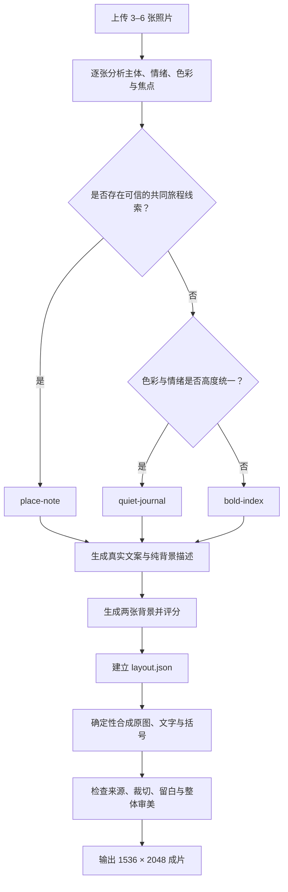

# Ins Photo Diary

把 3–6 张普通生活照片，合成一张有情绪、有留白、像杂志内页一样的 3:4 照片日记。

它不是随机套模板的拼图工具。Agent 会先理解整组照片的题材、色彩和叙事关系，再选择合适的视觉模式、生成纯背景，并用确定性脚本把所有原图排进最终画面。

> 只有背景允许生成。每一张前景小图都必须来自用户上传的原图，并且恰好出现一次。

## 它能做什么

- 接收 3–6 张 JPEG、PNG 或 WebP 图片。
- 自动判断照片的主体、情绪、主色、焦点和彼此关系。
- 在三种视觉模式中选择最适合的一种，而不是随机套版。
- 自动生成克制、真实的英文栏目词或短句。
- 生成两张纯背景候选，评分后选择更合适的一张。
- 输出一张 1536 × 2048 的 3:4 照片日记。
- 记录每张源图的 SHA-256 与裁切变换，方便追溯来源。

最终画面的共同语法是：

> 情绪背景 + 真实生活碎片 + 编辑排版 + 功能性括号 + 大面积留白

## 三种视觉模式

Skill 会根据素材关系自动路由到一种模式。

| 模式 | 适合什么照片 | 文案 | 字体与结构 |
| --- | --- | --- | --- |
| `bold-index` | 题材较杂、颜色跳跃、事件感强 | `weather`、`food`、`people` 等分类词 | Archivo Black 粗体，3–4 行栏目式结构 |
| `quiet-journal` | 色彩和情绪统一，自然、静物或独处感更强 | `soft rain`、`stillness` 等克制短语 | Cormorant Garamond 衬线体，中央紧凑小簇 |
| `place-note` | 照片来自同一次出行、同一地点或同一段旅程 | 由标题、连接词和可信地点组成的视觉句子 | Inter Light，照片像名词一样嵌入句子 |

选择顺序不是平均随机：

1. 只有存在可信的共同地点或旅程线索时，才使用 `place-note`。
2. 没有旅程线索，但综合色彩和情绪高度一致时，使用 `quiet-journal`。
3. 其余情况使用 `bold-index`。

当两种模式都合理时，Agent 会在同一背景上分别渲染低分辨率预览，再保留整体评分更高的一版。

## 工作流程



这里有两个彼此隔离的阶段：

- **审美导演阶段**：Agent 理解照片、选择模式、写文案、描述并生成背景。
- **确定性合成阶段**：本地脚本只做方向校正、sRGB 转换、焦点裁切、缩放、受控旋转、排字和合成。

用户照片会被宿主 Agent 用于视觉理解，但不会被附加、引用或上传到背景生成步骤中。生图模型只收到综合色彩、情绪、环境和留白方向等文字摘要。

## 不会做什么

- 不会生成、重绘、换脸、补画或替换前景照片。
- 不会给前景照片调色、重打光、生成式扩图或移除内容。
- 不会遗漏、重复或暗中筛掉用户上传的图片。
- 不会把任意一张用户照片直接当作背景。
- 不会虚构地点、日期、天气、人物身份或关系。
- 不会给图片加圆角、边框、相框、投影或贴纸。
- 不会横置人物、可读文字、建筑等有明确方向的主体。
- 不会在生图能力缺失时要求用户提供厂商 API Key 作为兜底。

## 运行要求

宿主 Agent 需要同时具备：

- 图片视觉理解能力；
- 能生成并保存位图文件的图片生成能力；
- 本地文件读写和命令执行能力；
- Python 3；
- Pillow。

输入范围为 3–6 张静态 JPEG、PNG 或 WebP。HEIC、PDF、GIF 和其他动态图需要先转换为受支持的静态格式。

如果宿主没有图片生成能力，Skill 会停止执行，不交付缺少背景质量控制的降级版本。

## 兼容哪些 Agent

这是一个通用 Agent Skill，不是 Codex 专用 Skill。

- **Codex**：可直接读取 `SKILL.md`；`agents/openai.yaml` 提供 OpenAI/Codex 界面元数据。
- **Claude Code、Cursor 及其他支持 Agent Skills 的宿主**：可以使用同一套 `SKILL.md`、参考文件、字体和 Python 脚本，并忽略 `agents/openai.yaml`。
- **不支持 `.skill` 包格式的 Agent**：解压后把完整目录放入宿主的 Skills 目录，或让 Agent 直接读取 `SKILL.md`。

兼容性的关键不在厂商名称，而在宿主是否具备视觉理解、生图、文件读写和 Python 执行能力。Skill 不调用 OpenAI、Anthropic 或其他厂商的专用 API，也不内置密钥。

## 安装

### 方式一：导入 `.skill` 包

如果宿主支持 `.skill` 包，直接导入：

```text
compose-ins-photo-diary.skill
```

### 方式二：安装目录

将 `compose-ins-photo-diary/` 整个目录复制到宿主的 Skills 目录。目录结构必须保留，不能只复制 `SKILL.md`，因为渲染器需要参考协议、Python 脚本和内置字体。

### 方式三：直接加载

如果宿主没有统一的 Skill 安装机制，让 Agent 先完整读取 `SKILL.md`，再按其中的相对路径调用资源。

## 使用方式

上传 3–6 张照片后，用自然语言提出需求即可。

```text
把这几张照片做成一张 Ins 风照片日记。
```

```text
用这些旅行照片做一张有地点感的 3:4 视觉日记，小图必须保留原图。
```

```text
把这 5 张生活照合成一张 mood collage，由你判断最适合的排版和背景。
```

```text
用 $compose-ins-photo-diary 处理我上传的照片。
```

正常情况下，Agent 会自动完成模式选择、背景候选评分、布局配置、最终渲染和来源检查，不需要用户手动选择字体或填写 JSON。

## 手动运行渲染器

大多数用户不需要直接运行脚本。调试或集成时，可以在 Skill 目录中执行：

```bash
python scripts/compose_ins_diary.py \
  --background <selected-background> \
  --layout <layout.json> \
  --output <final.png> \
  --provenance <final.provenance.json>
```

参数说明：

- `--background`：已经通过评分的背景图片。
- `--layout`：符合当前模式协议的布局文件。
- `--output`：最终 PNG 或 JPEG 文件。
- `--provenance`：可选的来源、哈希和裁切变换记录。

布局字段和验证规则见 `references/layout-contract.md`。旧版未声明 `composition_mode` 的布局会继续按 `bold-index` 处理。

## 质量控制

背景会从五个维度评分：

- 图文区域是否干净；
- 背景与原图色彩是否协调；
- 白色文字是否有足够对比；
- 环境是否有空间和情绪；
- 整体是否克制。

背景至少需要达到 20/25，并且不能出现文字、水印、拼贴框、醒目人物或占据图文区域的大型主体。

最终成片会再次检查模式匹配、文案真实性、字体节奏、原图辨识度和整体克制度，至少达到 21/25 才会交付。

## 目录结构

```text
compose-ins-photo-diary/
├── SKILL.md
├── README.md
├── agents/
│   └── openai.yaml
├── references/
│   ├── aesthetic-system.md
│   └── layout-contract.md
├── scripts/
│   └── compose_ins_diary.py
├── assets/
│   └── fonts/
├── tests/
└── evals/
```

- `SKILL.md` 是 Agent 的运行入口。
- `README.md` 面向人类读者，不参与运行时决策。
- `aesthetic-system.md` 负责审美分析、模式路由、文案、背景提示和评分。
- `layout-contract.md` 只在模式确定后读取，定义布局 JSON 和验证约束。
- `compose_ins_diary.py` 负责确定性排版和 provenance 检查。
- `assets/fonts/` 内置 Archivo Black、Inter 和 Cormorant Garamond，以及对应 OFL 许可证。
- `tests/` 和 `evals/` 用于开发验证，不进入精简分发包。

## 为什么分发包里没有案例图片

案例图片不是运行依赖，也不应该成为固定模板。这个 Skill 把审美能力保存在模式路由、文字规则、背景约束、确定性几何和评分标准里。

移除案例图片有三个好处：

- 减小分发包体积；
- 避免公开分发生活照片带来的隐私和版权问题；
- 避免 Agent 机械复刻某一张成品，让版式真正跟随用户素材变化。

## 字体与声明

Archivo Black、Inter 和 Cormorant Garamond 随 Skill 一起分发，对应的 OFL 许可证保存在 `assets/fonts/`。

“Ins 风”用于描述 Instagram-inspired 的编辑视觉方向。本项目不是 Instagram 官方产品，也不代表任何平台或品牌的授权、背书或从属关系。
